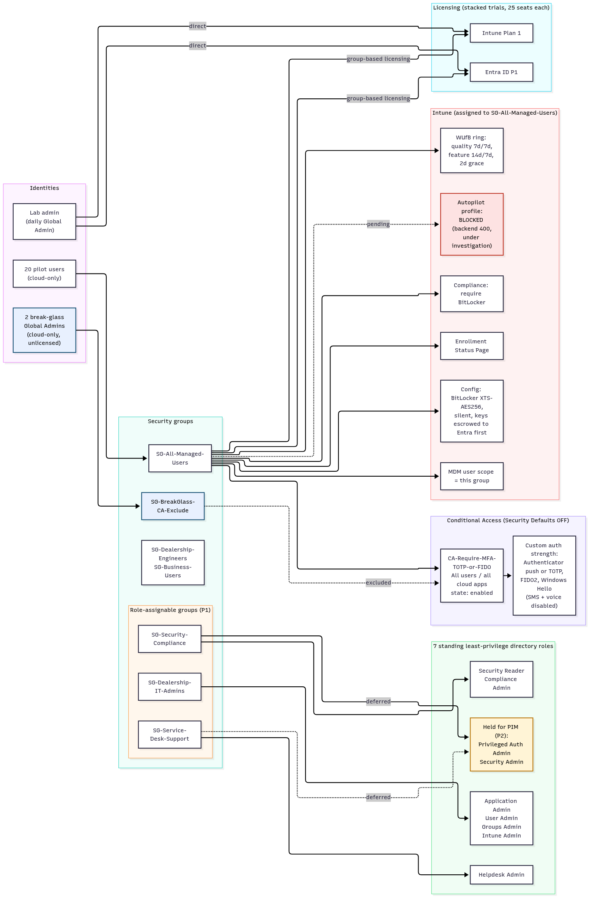

# Case study: Zero-to-baseline Intune and Entra ID security build

**Alexander Paulino** · Endpoint & identity security lab · October 2026
**Environment:** contoso-style Microsoft 365 test tenant for a fictional auto dealership ("Sonia's Auto Sales"). No real users, customers, or data.

> Screenshots are placeholders and will be added with tenant details redacted. The operational procedure this lab validated is SOP-075, [Entra ID P1/P2 license trial](../../workflows/entra-p1-p2-trial.md); interview material is in [resume-bullets.md](resume-bullets.md).

---

## Scenario

A small dealership tenant started almost empty: one admin account, Security Defaults on, Intune Plan 1 only, no groups, no devices, no Conditional Access. The goal was to stand up a defensible identity and endpoint baseline the way a real IT team would: least privilege, strong MFA with no SMS or voice, encrypted and patched devices, and a paper trail that an auditor could check.

## Objectives

1. Never leave the tenant without MFA, at any point in the rollout.
2. Keep an emergency way in that no policy can lock out.
3. Give admins only the roles they need, assigned to groups instead of people.
4. Enforce BitLocker and a controlled Windows Update cadence on managed devices.
5. Make every change reviewable and provable: scripted, approved, logged, and backed by Microsoft's own audit records.

## Architecture summary

One group, **SG-All-Managed-Users**, is the control point. Membership in it licenses a user (group-based licensing), puts them under the require-MFA Conditional Access policy, scopes them for automatic MDM enrollment, and targets every Intune policy. Two break-glass admins sit in a separate exclusion group outside all of it. Admin roles are bound to three role-assignable groups.

Full diagram: [`architecture.md`](architecture.md) · 

## What I built, and why

| Control | What | Why / tradeoff |
|---|---|---|
| **Groups** | 4 non-privileged security groups, incl. SG-All-Managed-Users and a break-glass CA exclusion group | Built first because they need no premium license. Policies target groups, never individuals. |
| **Break-glass** | 2 cloud-only Global Admins, excluded from CA, unlicensed, long random passwords that never expire | Microsoft guidance calls for at least two. The daily admin account is the main phishing target, so the emergency path must be separate. The script refuses to overwrite an existing secret, so a re-run can't silently reset an emergency password. |
| **BitLocker** | Compliance policy requiring BitLocker; config policy with XTS-AES256, silent encryption, keys escrowed to Entra **before** encryption starts | I caught a bug in the original script that would have encrypted devices without guaranteed key escrow. Git stores proof of escrow (key IDs and timestamps), never the keys. |
| **Enrollment Status Page** | Progress shown, 60-minute timeout, log collection and reset allowed on failure | Ready for Autopilot; the tenant default ESP was left alone. |
| **Windows Update for Business** | Broad ring: quality updates 7-day deferral / 7-day deadline, feature updates 14 / 7, 2-day grace, no reboot postponement past deadline | The deferrals leave room for a faster pilot ring to soak updates first. Deadlines cap how long a user can put off patching. |
| **Licensing** | Entra ID P1 and Intune Plan 1 trials stacked on purpose; group-based licensing on the managed-users group | Overlapping trial windows meant more could be tested per trial day. Group licensing makes onboarding a single group add. |
| **Least-privilege roles** | 3 role-assignable groups carrying 7 standing directory roles (e.g. Intune Admin, Helpdesk Admin, Security Reader) | The role-assignable flag can only be set when the group is created, so I waited for P1 instead of creating the groups wrong and rebuilding them later. Privileged Authentication Admin and Security Admin are **held back** until PIM (P2) can make them just-in-time. |
| **Conditional Access** | One enabled policy: all users, all cloud apps, MFA through a **custom authentication strength** (Authenticator push or TOTP, FIDO2, Windows Hello). SMS and voice turned off tenant-wide. Break-glass excluded. Security Defaults off. | SMS and voice can be phished or SIM-swapped. A custom strength enforces the stronger methods instead of just "any MFA". |
| **MDM user scope** | Automatic enrollment scoped to the managed-users group (MAM untouched) | Scoping to a group, not "All", limits enrollment to the pilot population. |
| **Pilot population** | 20 licensed pilot users in the managed-users group (21 of 25 seats used per SKU) | Leaves headroom in the trial while giving the policies a realistic population. |

[screenshot: CA policy, tenant details redacted]
[screenshot: custom authentication strength, tenant details redacted]
[screenshot: role-assignable groups with assigned roles, tenant details redacted]
[screenshot: BitLocker configuration profile, tenant details redacted]
[screenshot: WUfB ring settings, tenant details redacted]

## Security outcomes

- **No MFA gap.** I re-sequenced the cutover so the require-MFA policy existed before Security Defaults was turned off. The original plan would have left the tenant with no MFA.
- **No SMS or voice MFA.** Only Authenticator push/TOTP or phishing-resistant FIDO2 / Windows Hello satisfy CA.
- **Lockout-proof.** Two excluded break-glass accounts survive any CA misfire.
- **Scoped admin roles.** Seven task-specific roles are assigned to groups instead of handing out Global Admin; the two most sensitive are waiting for just-in-time access.
- **Encryption with recoverability.** BitLocker cannot start until the recovery key is escrowed.
- **Auditable.** 12 evidence snapshots, each with raw Graph JSON, Microsoft-authored audit logs, a SHA-256 manifest, and a chain-hash file.

## How I work

- **Automation:** every change is a Microsoft Graph call from PowerShell 7.4 (Graph SDK pinned to 2.25.0), not a portal click, so it can be reviewed and repeated. Scripts check for existing objects before they create anything, so re-runs are safe.
- **Auth:** device-code sign-in, so the admin enters password and MFA in their own browser and the automation never sees credentials. Tokens are held in memory only. Each session requests only the write scopes it needs; for example, the early sessions couldn't touch Conditional Access at all.
- **Approval:** every change that matters is described first and run only after explicit human approval.
- **Records:** a decision log (what and why), a per-step live-apply journal, and an append-only failed-hypotheses log (15 entries so far).

## How I debug

I keep wrong ideas on the record. Three examples from the failed-hypotheses log:

**1. "Autopilot is blocked because Entra ID P1 is missing." Disproven.**
Creating an Autopilot deployment profile returned an opaque backend 400 ("An error has occurred", no detail). On a base Intune license, missing P1 looked like the obvious cause, and I wrote it up that way. Then I tested it: activated P1, assigned it, and retried. I got the identical error. Next I scoped automatic enrollment (the MDM user scope) to the managed-users group and retried once. Same error again.
*Lesson:* a plausible prerequisite is not a root cause. State it as a hypothesis with a test that could prove it wrong, change one variable at a time, and don't publish the conclusion until the test passes. I corrected the published SOP when the test failed.

**2. Conditional Access vs Security Defaults ordering.**
The original script turned Security Defaults off *before* creating CA policies, and its CA baseline had no require-MFA rule at all. Either problem alone would have removed MFA from the whole tenant. I moved require-MFA to the front. Then Graph refused to create an *enabled* CA policy while Security Defaults was still on (HTTP 400). The fix: create the policy in report-only mode, turn Security Defaults off, then enable the policy in the same session. The enable call briefly returned 404 because of replication delay and succeeded about a minute later.
*Lesson:* order the change so the safety net exists first, keep the exposure window short, and retry with backoff when directory writes haven't replicated yet.

**3. Group-based licensing collision.**
While licensing 20 pilot users, I assumed the managed-users group had no license configuration and assigned licenses directly to each user. 7 of 19 direct calls failed with HTTP 409 concurrency errors. The audit log showed why: the group already had group-based licensing, set earlier in the portal but never written to the decision log, and the licensing service was writing the same licenses at the same moment. Every pilot ended up licensed through the group, so the outcome was fine, but 12 users now carry a redundant direct assignment.
*Lesson:* read a group's assigned licenses before licensing its members, and log every portal-side change, because the undocumented one is what caused this.

## Current status and next steps

- **Autopilot: blocked, under investigation.** The profile-create API still returns the opaque 400. Ruled out so far: request body shape, MDM authority, missing P1, and the MDM user scope. Remaining hypotheses: the Autopilot service isn't initialized until the profile blade is first used in the Intune admin center, or there's a backend service issue. Next step is to create one profile in the portal and compare its request with the scripted one. If the portal fails too, I'll open a Microsoft support case with the captured activity IDs.
- **Licensing cleanup:** move pilots to group-only licensing by removing the 12 redundant direct assignments (needs approval).
- **Rest of the CA baseline:** block legacy authentication; require a compliant device, kept in report-only until a compliant device exists so the admin can't be locked out.
- **PIM (P2):** convert privileged roles to eligible, just-in-time assignments; then Intune RBAC roles.
- **Break-glass hardening:** register FIDO2 keys and run a test emergency sign-in.
- **Trial exit plan:** before the trials lapse, either buy the licenses or turn Security Defaults back on *first*, so MFA never drops.

## Tools and skills

Microsoft Intune · Microsoft Entra ID (P1) · Conditional Access · authentication strengths · Security Defaults · role-assignable groups / directory RBAC · group-based licensing · Windows Autopilot and Enrollment Status Page · BitLocker · Windows Update for Business · Microsoft Graph (v1.0 and beta) · PowerShell 7 / Microsoft Graph PowerShell SDK · OAuth 2.0 device-code flow · Entra and Intune audit logs · SHA-256 evidence manifests · change management and SOP writing (MkDocs) · Git

---
*All identifiers (tenant, domain, object IDs, accounts, request IDs) are deliberately omitted. Group and policy names are the lab's own naming convention.*
