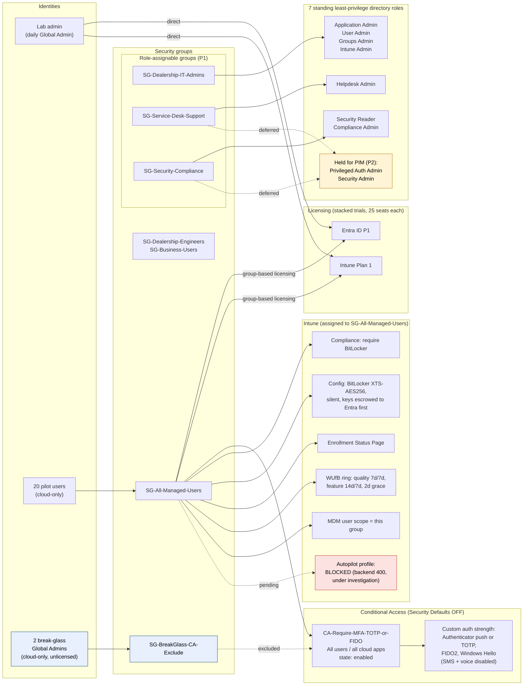

# Architecture: Intune / Entra ID security lab

Contoso-style test tenant for a fictional auto dealership ("Sonia's Auto Sales"). No real users or data. Group names below are the lab's real naming convention; all identifiers (tenant, object IDs, accounts) are omitted.

## Reading the diagram

- **Solid arrows** are live, verified configuration. **Dotted arrows** are exclusions, deferrals, or blocked work.
- **One group drives the endpoint baseline.** SG-All-Managed-Users is the target for licensing, Conditional Access scope, every Intune policy, and the MDM user scope. Adding a user to it is the whole onboarding step.
- **Break-glass is outside everything.** Two cloud-only Global Admins sit in an exclusion group that the CA policy skips, and they hold no licenses.
- **Admin access goes through groups, not people.** Roles are assigned to role-assignable groups. The two most sensitive roles are held back until PIM (Entra ID P2) can make them just-in-time.
- **Autopilot is the open item.** The deployment profile cannot be created yet (see the case study).

Rendered image: [`architecture.png`](architecture.png)
